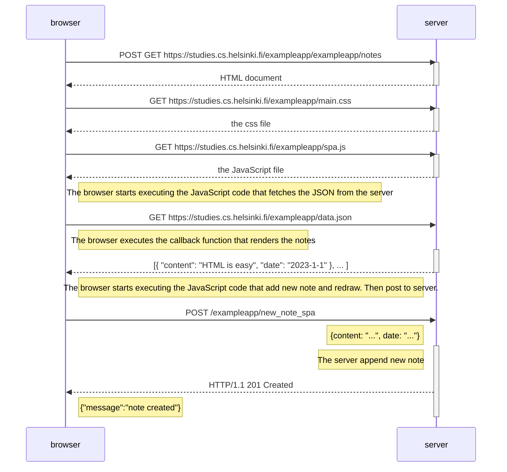

```mermaid
sequenceDiagram
    participant browser
    participant server

    browser->>server: POST GET https://studies.cs.helsinki.fi/exampleapp/exampleapp/notes
    activate server
    server-->>browser: HTML document
    deactivate server

    browser->>server: GET https://studies.cs.helsinki.fi/exampleapp/main.css
    activate server
    server-->>browser: the css file
    deactivate server

    browser->>server: GET https://studies.cs.helsinki.fi/exampleapp/spa.js
    activate server
    server-->>browser: the JavaScript file
    deactivate server

    Note right of browser: The browser starts executing the JavaScript code that fetches the JSON from the server

    browser->>server: GET https://studies.cs.helsinki.fi/exampleapp/data.json

    Note right of browser: The browser executes the callback function that renders the notes
    activate server
    server-->>browser: [{ "content": "HTML is easy", "date": "2023-1-1" }, ... ]
    deactivate server

    Note right of browser: The browser starts executing the JavaScript code that add new note and redraw. Then post to server.
    browser->>server: POST /exampleapp/new_note_spa
    Note left of server: {content: "...", date: "..."}

    activate server 
    Note left of server: The server append new note
    server-->>browser: HTTP/1.1 201 Created
    Note right of browser: {"message":"note created"}
    deactivate server

    

    
```
