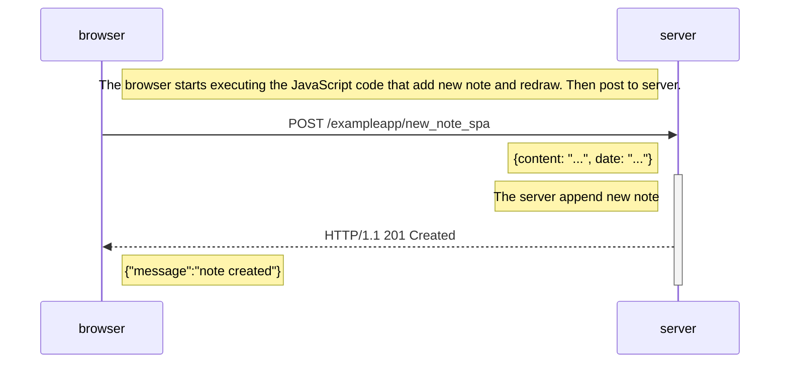

```mermaid
sequenceDiagram
    participant browser
    participant server
        
    Note right of browser: The browser starts executing the JavaScript code that add new note and redraw. Then post to server.
    browser->>server: POST /exampleapp/new_note_spa
    Note left of server: {content: "...", date: "..."}

    activate server 
    Note left of server: The server append new note
    server-->>browser: HTTP/1.1 201 Created
    Note right of browser: {"message":"note created"}
    deactivate server

    

    
```
